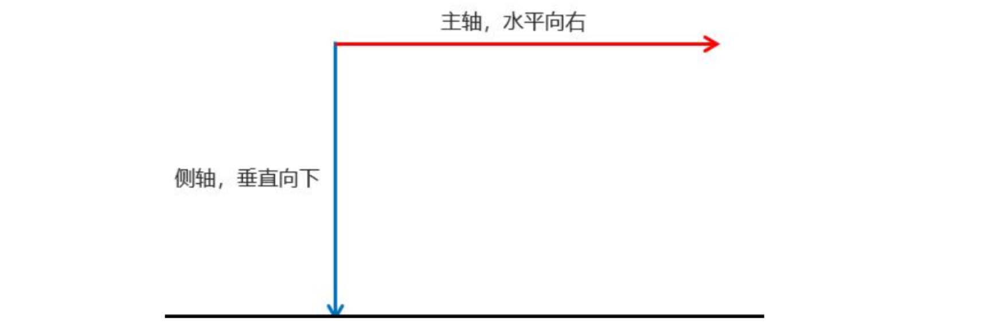
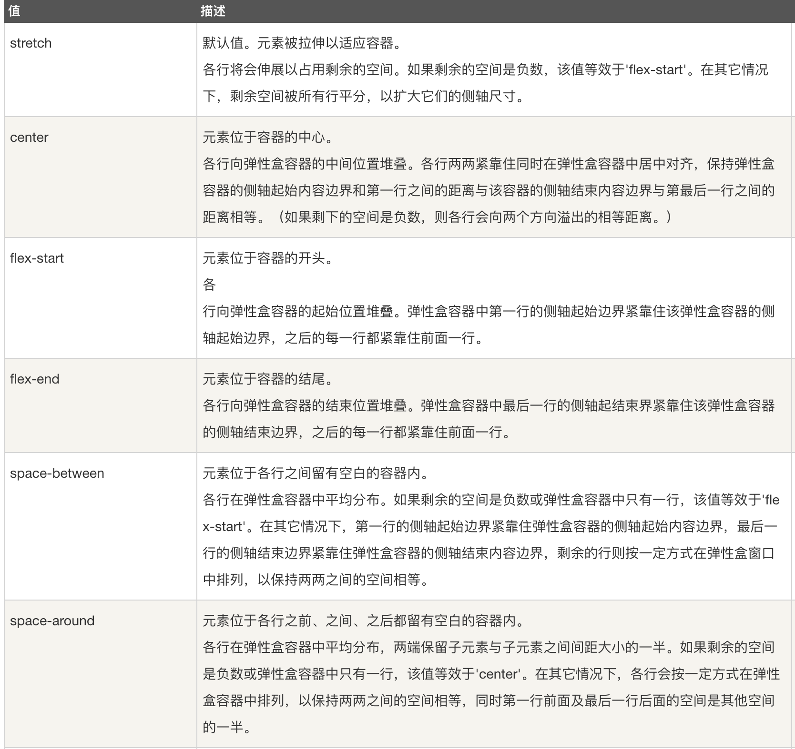

# CSS3

- 圆角
- 阴影
- 2D转换
- 动画
- ....

## 2D转换 transform

### 移动 translate

1. **translate**中的百分比单位是相对于自身元素的  `translate:(50%,50%);`
2. **translate**类似定位，不会影响到其他元素的位置
3. 对行内标签没有效果

### 旋转 rotate

2d旋转指的是让元素在2维平面内顺时针旋转或者逆时针旋转

使用步骤：

1. 给元素添加转换属性 `transform`
2. 属性值为 `rotate(角度)`  如 `transform:rotate(30deg)`  顺时针方向旋转**30度**

```css
div{
      transform: rotate(0deg);
}
```

- 转换中心 transform-origin 了解
- 该属性可以修改元素旋转的时候的中心点

1. transform-origin:**50% 50%;**  默认值  元素的中心位置 百分比是相对于自身的宽度和高度
2. transform-origin:**top left;**  左上角   和 transform-origin：0 0;相同
3. transform-origin:**50px 50px;**  距离左上角 50px 50px 的位置
4. transform-origin：**0**;  只写一个值的时候  第二个值默认为 50%;

### 缩放 scale

只要给元素添加上了这个属性就能控制它放大还是缩小 

步骤：

1. 给元素添加转换属性 `transform`
2. 转换的属性值为 `scale(宽的倍数,高的倍数)`    如 宽变为两倍，高变为3倍 `transform:scale(2,3)`

```css
div{
    transform:scale(2,3);
}
```

## 动画 animation

初学者容易对 **动画** 和 **过渡** 傻傻分不清楚

过渡 只能看到一次变化过程 如 **宽度  1000px  变化到  100px** 

**动画 可以设置变化的次数 甚至是无数次**   


### 使用步骤

1. 在css中定义动画函数     
2. 给目标元素调用动画函数

```css
/* 1 声明动画函数 */

    @keyframes ani_div {
      0%{
        width: 100px;
        background-color: red;
      }
      50%{
        width: 150px;
        background-color: green;
      }
      100%{
        width: 300px;
        height: 300px;
        background-color: yellow;
      }
    }

    div {
      width: 200px;
      height: 200px;
      background-color: aqua;
      margin: 100px auto;
      /* 2 调用动画 */
      animation-name: ani_div;
      /* 持续时间 */
      animation-duration: 2s;
    }
```

### 语法

1. 动画名

    设置要使用的动画名 `animation-name:xxx;`

2. 持续时间

    设置动画播放的持续时间  `animation-duration:3s`

3. 速度曲线

    和设置过渡的速度曲线一样 `animation-timing-function:linear;`

    - linear： 匀速
    - ease： 慢-快-慢  默认值
    - ease-in： 慢-快。
    - ease-out： 快-慢。
    - ease-in-out： 慢-快-慢。
    - steps()：指定了时间函数中的间隔数量（步长）

4. 延迟时间

    `animation-delay: 0s;`

5. 循环次数

    设置动画播放的循环次数  `animation-iteration-count: 2;`  **infinite** 为无限循环

6. 循环方向

    `animation-direction`

    如在动画中定义了  **0%：红色**  **100%：黑色** 那么 当属性值为 

    1. **normal**  默认值  **红 -> 黑**
    2. **reverse** 反向运行    **黑 -> 红**
    3. **alternate**  正-反-正...  **红 -> 黑 -> 红...**  
    4. **alternate-reverse**  反-正-反..   **黑 -> 红 -> 黑 ...** 
    5. 以上与循环次数有关

7. 动画等待或者结束的状态

    `animation-fill-mode` 设置动画在等待或者结束的时候的状态

    - **forwards**：动画结束后，元素样式停留在 100% 的样式
    - **backwards**： 在延迟等待的时间内，元素样式停留在 0% 的样式
    - **both**： 同时设置了 forwards和backwards两个属性值

8. 暂停和播放

    `animation-play-state`  控制 **播放** 还是 **暂停** 

    `running` 播放   `paused` 暂停

### 复合写法

```css
animation: name duration timing-function delay iteration-count direction fill-mode;
```

### 多个动画写法

用逗号分隔

```css
animation:
name duration timing-function delay iteration-count direction fill-mode，
animation: name duration timing-function delay iteration-count direction fill-mode;
```

### 动画结束事件animationend

元素在动画结束之后，会自动触发的事件 **animationend**   

```javascript
    var div = document.querySelector("div");
    div.addEventListener("animationend", function () {
      console.log("div的动画结束之后，触发");
    })
```

# flex布局

## flex布局原理

就是通过给父盒子添加flex属性，来控制子盒子的位置和排列方式

## 父项常见属性

- flex-direction：设置主轴的方向
- justify-content：设置主轴上的子元素排列方式
- flex-wrap：设置子元素是否换行  
- align-content：设置侧轴上的子元素的排列方式（多行）
- align-items：设置侧轴上的子元素排列方式（单行）
- flex-flow：复合属性，相当于同时设置了 flex-direction 和 flex-wrap

### flex-direction设置主轴的方向

- 在 flex 布局中，是分为主轴和侧轴两个方向，同样的叫法有 ： 行和列、x 轴和y 轴
- 默认主轴方向就是 x 轴方向，水平向右
- 默认侧轴方向就是 y 轴方向，水平向下



- 注意： 主轴和侧轴是会变化的，就看 flex-direction 设置谁为主轴，剩下的就是侧轴。而我们的子元素是跟着主轴来排列的

    

    

### justify-content 设置主轴上的子元素排列方式


### flex-wrap设置是否换行

- 默认情况下，项目都排在一条线（又称”轴线”）上。flex-wrap属性定义，flex布局中默认是不换行的。
- nowrap 不换行
- wrap 换行

### align-items 设置侧轴上的子元素排列方式（单行 ）

- 该属性是控制子项在侧轴（默认是y轴）上的排列方式  在子项为单项（单行）的时候使用
- flex-start 从头部开始
- flex-end 从尾部开始
- center 居中显示
- stretch 拉伸

### align-content  设置侧轴上的子元素的排列方式（多行）

设置子项在侧轴上的排列方式 并且只能用于子项出现 换行 的情况（多行），在单行下是没有效果的。



### align-content 和align-items区别

- align-items  适用于单行情况下， 只有上对齐、下对齐、居中和 拉伸
- align-content适应于换行（多行）的情况下（单行情况下无效）， 可以设置 上对齐、下对齐、居中、拉伸以及平均分配剩余空间等属性值。 
- 总结就是单行找align-items  多行找 align-content

### flex-flow 属性是 flex-direction 和 flex-wrap 属性的复合属性

```
flex-flow:row wrap;
```

## 子项常见属性

- flex子项目占的份数
- align-self控制子项自己在侧轴的排列方式
- order属性定义子项的排列顺序（前后顺序）

### flex 属性

flex 属性定义子项目分配剩余空间，用flex来表示占多少份数。

```
.item {
    flex: <number>; /* 默认值 0 */
}

```

### align-self控制子项自己在侧轴上的排列方式

align-self 属性允许单个项目有与其他项目不一样的对齐方式，可覆盖 align-items 属性。

默认值为 auto，表示继承父元素的 align-items 属性，如果没有父元素，则等同于 stretch。

```
span:nth-child(2) {
      /* 设置自己在侧轴上的排列方式 */
      align-self: flex-end;
}

```

### order 属性定义项目的排列顺序

数值越小，排列越靠前，默认为0。

注意：和 z-index 不一样。

```
.item {
    order: <number>;
}
```

