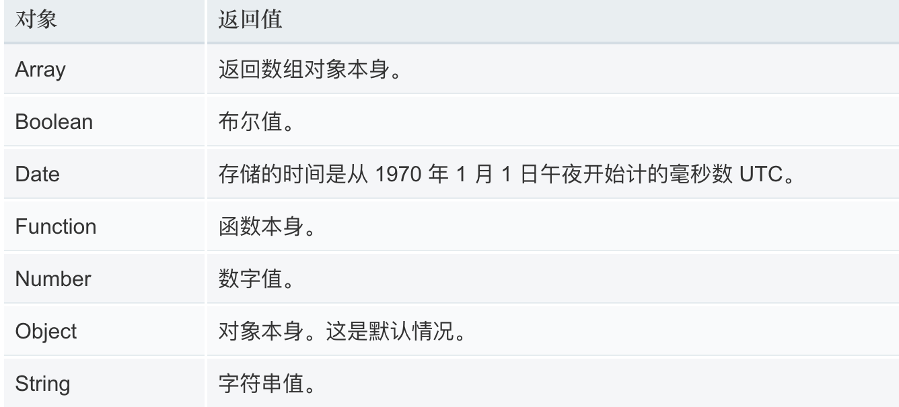

## 面试题

完成一个函数。可以实现如下效果：

`fn(1, 2, 3)  // 6`

`fn(1, 2)(3) // 6`

`fn(1)(2, 3) // 6`

`fn(1)(2)(3) // 6`

## 闭包

函数和对其周围状态（**lexical environment，词法环境**）的引用捆绑在一起构成**闭包**（**closure**）。

```js
function out () {
    let i = 1;
    function inner () {
        console.log(i++);
    }
    return inner;
}

// 调用函数，会得到该函数的返回值；
// out函数被调用，会得到它的返回值，即inner函数
let fn = out(); // fn 相当于是 inner
fn();  // 1
fn();  // 2
fn();  // 3
```

> 闭包最大的特点，就是函数运行完毕。内存不会自动释放。

## toString()

### 概述

每个对象都有一个 `toString()` 方法。

该方法在特定情况下会自动被调用，当然也可以手动调用它。

- 当该对象被表示为一个文本值时，自动调用
- 一个对象以预期的字符串方式引用时自动调用。

默认情况下，`toString()` 方法被每个 `Object` 对象继承。如果此方法在自定义对象中未被覆盖，`toString()` 返回 "[object *type*]"，其中 `type` 是对象的类型。

```js
var o = new Object();
o.toString(); // returns [object Object]

document.toString()  // "[object HTMLDocument]"

Math.toString() // "[object Math]"

[1, 2].toString() // 1,2
```

> 你会发现，数组.toString()，并非得到 [object Array]是因为数组对toString方法进行了重写。类似的还有很多其他对象。

### 检测对象的类型

可以通过 `toString()` 来获取每个对象的类型。为了每个对象都能通过 `Object.prototype.toString()` 来检测，需要以 `Function.prototype.call()` 或者 `Function.prototype.apply()` 的形式来调用，传递要检查的对象作为第一个参数，称为 `thisArg`。

```js
toString.call([]); // "[object Array]"

toString.call(new Date()) // "[object Date]"
```

### 重写对象的toString()

可以自定义一个方法，来取代默认的 `toString()` 方法。该 `toString()` 方法不能传入参数，并且必须返回一个字符串。自定义的 `toString()` 方法可以是任何我们需要的值，但如果它附带有关对象的信息，它将变得非常有用。

```js
let obj = {
    toString: function () {
        return 'hello';
    }
}

// 下面调用对象，但是，是把对象当做字符串使用。这样，对象的toString()方法会自动调用
console.log(`${obj}`); // "hello"

```

### 重写函数的toString()

函数也是对象，也有toString()方法。默认的toString()返回函数的文本表示

```js
function test () {
    let age = 20;
    console.log(age);
}

console.log(test.toString());
// 输出如下：
/*
function test () {
    let age = 20;
    console.log(age);
}
*/
```

重写函数的toString()

```js
function test () {
    let age = 20;
    console.log(age);
}

// 重写函数的toString()
test.toString = function () {
    return 'hello';
}

// 直接调用toString
console.log(test.toString()); // "hello"
// 把函数当做字符串使用，自动触发toString()
console.log(`${test}`); // "hello"
```

## valueOf()

### 概述

`valueOf()` 方法返回指定对象的原始值。

JavaScript调用`valueOf`方法将对象转换为原始值。你很少需要自己调用`valueOf`方法；当遇到要预期的原始值的对象时，JavaScript会自动调用它。

默认情况下，`valueOf`方法由[`Object`](https://developer.mozilla.org/zh-CN/docs/Web/JavaScript/Reference/Global_Objects/Object)后面的每个对象继承。 每个内置的核心对象都会覆盖此方法以返回适当的值。如果对象没有原始值，则`valueOf`将返回对象本身。

JavaScript的许多内置对象都重写了该函数，以实现更适合自身的功能需要。因此，不同类型对象的valueOf()方法的返回值和返回值类型均可能不同。



### 重写对象的valueOf()

无论是内置对象还是自定义对象，我们都可以重写其 `valueOf`方法。

```js
// 重写内置对象的valueOf
Array.prototype.valueOf = function () {
    return 'hello';
}

console.log([1, 2] + 123); // hello123

// 重写自定义对象的valueOf
let obj = {
    valueOf: function () {
        return 'hello';
    }
}

console.log(obj + 123); // hello123
```

### 重写函数的valueOf()

```js
function test () {

}
test.valueOf = function () {
    return 'hello';
}

console.log(test + 123); // hello123
```

## toString和valueOf小结

如果对象或者函数，

如果一个对象或者函数，同时拥有toString()和valueOf，会先调用谁？

- 只有把对象或函数 **以预期的字符串方式引用时**，会调用 `toString()`
- 其他情况，都是优先调用 `valueOf()`

```js
function test () {

}
test.valueOf = function () {
    return 'hello';
}
test.toString = function () {
    return 'nihao'
}

console.log(test + 123); // hello123
console.log(`${test}`); // nihao

```

